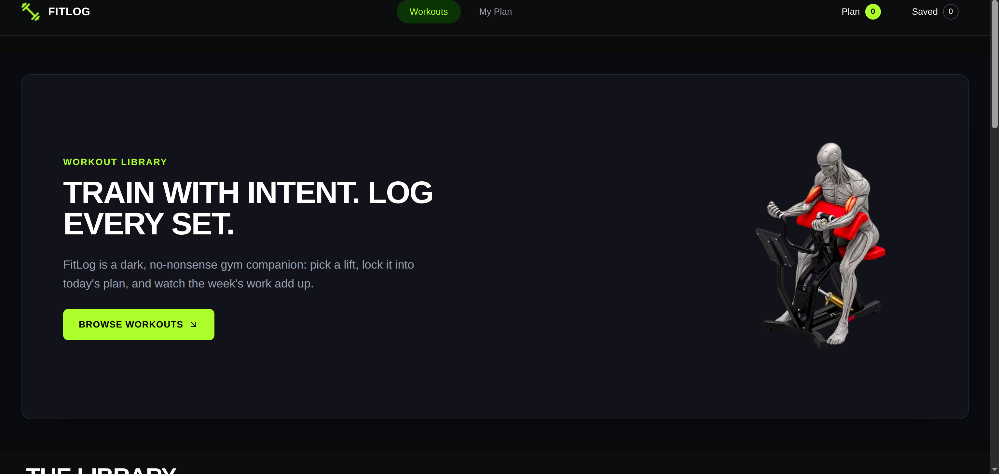

# 🏋️ FitLog — Workout Library & Plan Tracker

FitLog is a modern and responsive workout tracking web application built with **Next.js, React, TypeScript, and Tailwind CSS**.

Users can explore different exercises, view detailed workout information, build their daily workout plan, save exercises for later, and track completed workouts.

The application features a clean dark-themed interface and is fully responsive across **mobile, tablet, and desktop** devices.

---

## 🚀 Live Project

🌐 **Live Website:**
https://fit-log-web-3piv.vercel.app/

📦 **GitHub Repository:**
https://github.com/shahidul91325/Fit-Log-Web

---

## 📸 Project Screenshot



---

## ✨ Key Features

### 🏋️ Workout Library

Browse a collection of workouts with useful information including:

* Workout name
* Muscle groups
* Equipment
* Difficulty
* Duration
* Calories burned
* Rating

### 📋 Workout Details

View detailed information about each exercise, including:

* Exercise description
* Muscle groups
* Equipment
* Difficulty level
* Sets and reps
* Duration
* Calories
* Rating
* Step-by-step instructions

### 📅 My Plan

Build and manage your daily workout plan.

* Add exercises to today's plan
* Remove exercises from the plan
* Mark workouts as completed
* View total workout duration
* Track total calories
* Sort workouts by duration, rating, or calories

### 🔖 Save Workouts

Save exercises for later and manage saved workouts from the My Plan section.

### 🔔 Toast Notifications

Get instant feedback when adding, saving, removing, or completing workouts.

### ⏳ Loading State

Provides a custom loading experience while workout data is being loaded.

### ❌ Custom 404 Page

Includes a custom Not Found page for invalid routes.

---

## 🛠️ Technologies Used

### Frontend

<p>
  
</p>

* **Next.js 16**
* **React 19**
* **TypeScript**
* **Tailwind CSS 4**

### Libraries & Tools

* **React Icons** — Icons and UI elements
* **React Toastify** — Toast notifications
* **Context API** — Application state management
* **Fetch API** — API data fetching
* **ESLint** — Code quality and linting
* **Vercel** — Deployment

---

## 📦 Dependencies

### Main Dependencies

```text
next
react
react-dom
react-icons
react-toastify
```

### Development Dependencies

```text
@tailwindcss/postcss
@types/node
@types/react
@types/react-dom
eslint
eslint-config-next
tailwindcss
typescript
```

> Dependency versions are managed through the project's `package.json` file.

---

## 🔌 API Integration

Workout data is fetched dynamically from the FitLog REST API.

### Workout API

```text
https://api.abcz.workers.dev/api/fitlog
```

### Exercise Details API

Individual exercise details can be accessed using the exercise ID:

```text
https://api.abcz.workers.dev/api/fitlog/:id
```

The API provides information such as:

* Exercise name
* Image
* Muscle groups
* Equipment
* Difficulty
* Duration
* Calories burned
* Sets
* Reps
* Rating
* Description
* Instructions

---

## 📂 Main Pages

| Route             | Description                   |
| ----------------- | ----------------------------- |
| `/`               | Workout Library               |
| `/exercises/[id]` | Workout Details               |
| `/my-plan`        | Today's Plan & Saved Workouts |
| `/404`            | Custom Not Found Page         |

---

## 📱 Responsive Design

FitLog is designed to work smoothly across different screen sizes.

### 📱 Mobile

* Responsive navigation
* Stacked workout cards
* Mobile-friendly workout details
* Responsive buttons and controls

### 📲 Tablet

* Adaptive grid layouts
* Responsive navigation
* Optimized spacing and content layout

### 💻 Desktop

* Multi-column workout library
* Two-column workout details
* Spacious dashboard layout
* Optimized desktop navigation

---

## 🎯 Project Highlights

* 🏋️ Modern workout library
* 🌙 Clean dark-themed interface
* 📱 Fully responsive design
* 🔌 Dynamic REST API integration
* 📋 Interactive workout planning
* 🔖 Save workouts for later
* ✅ Workout completion tracking
* 🔄 Workout sorting functionality
* 🔔 Toast notifications
* ⏳ Custom loading state
* ❌ Custom 404 page
* ⚡ Next.js App Router
* 🧩 React Context API
* 🎨 Tailwind CSS responsive UI

---

## 💻 Run Locally

Follow these steps to run FitLog on your local machine.

### 1. Clone the repository

```bash
git clone https://github.com/shahidul91325/Fit-Log-Web.git
```

### 2. Navigate to the project directory

```bash
cd Fit-Log-Web
```

### 3. Install dependencies

```bash
npm install
```

### 4. Start the development server

```bash
npm run dev
```

### 5. Open the application

Open your browser and visit:

```text
http://localhost:3000
```

---

## 🏗️ Build for Production

To create an optimized production build:

```bash
npm run build
```

Then start the production server:

```bash
npm start
```

---

## 📜 Available Scripts

| Command         | Description                   |
| --------------- | ----------------------------- |
| `npm run dev`   | Starts the development server |
| `npm run build` | Creates a production build    |
| `npm start`     | Runs the production server    |
| `npm run lint`  | Runs ESLint                   |

---

## 🔗 Relevant Links

### 🌐 Live Website

https://fit-log-web-3piv.vercel.app/

### 📦 GitHub Repository

https://github.com/shahidul91325/Fit-Log-Web

### 🔌 FitLog API

https://api.abcz.workers.dev/api/fitlog

---

## 📁 Project Structure

```text
Fit-Log-Web/
│
├── public/
│   ├── banner.png
│   ├── logo.png
│   └── fitlog-preview.png
│
├── src/
│   ├── app/
│   ├── components/
│   ├── context-provider/
│   └── ...
│
├── package.json
├── package-lock.json
├── next.config.ts
├── tsconfig.json
└── README.md
```

---

## 👨‍💻 Developer

### Md. Shahidul Islam

Aspiring Full-Stack Developer from Bangladesh.

This project was built as part of my journey toward becoming a professional Full-Stack Developer while practicing modern frontend development, API integration, state management, and responsive UI design.

Built with ❤️ using:

**Next.js • React • TypeScript • Tailwind CSS**

---

## 📄 License

This project was created for learning and educational purposes.
